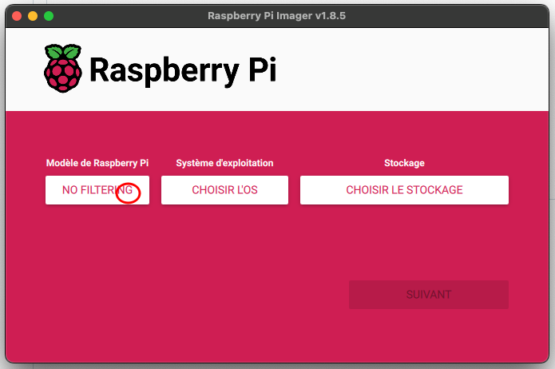
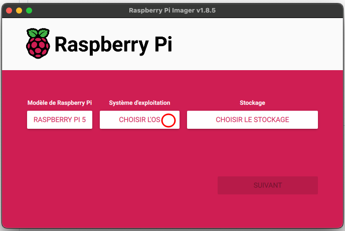
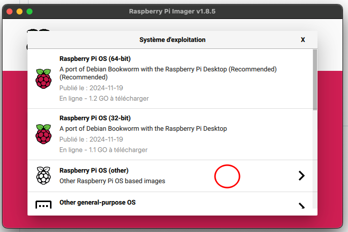
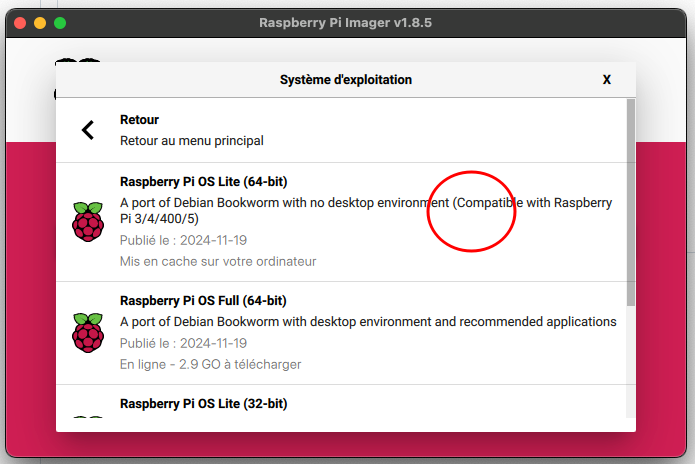

<h1 align="left">Install OctoPrint and Klipper on Raspberry PI5</h1>

###

Stream URL: /webcam/?action=stream Snapshot URL: http://127.0.0.1:8080/?action=snapshot

###

	mv .octoprint/config.yaml .octoprint/config.yamlCP
    mv config.yaml .octoprint/config.yaml 

  

  

  

  

  

  

  

  

  

  

  

###